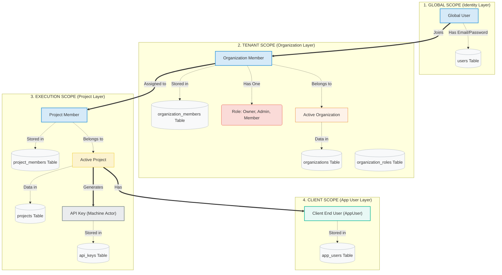

# WorkLayer Project Context (Engineer Onboarding)

---

## Summary

`worklayer` is a monorepo with:

- A Go API (`cmd`, `internal`, `pkg`)
- A TanStack Start React console app (`apps/console-app`)

Current product scope:

- Authentication + session management
- Organization management
- Organization membership + invitation flows
- Organization RBAC (roles/permissions)
- Project management (CRUD, archiving, restore)
- Project membership (add/remove/role change/leave)
- Project-scoped API keys (generate/revoke, dev/live modes, rate limits)
- Audit event scaffolding (with partial UI implementation)

Backend architecture follows:

- `controller -> service -> repository -> domain -> GORM/Postgres`

Frontend architecture follows:

- File-based route-driven UI
- React Query for API data/mutations
- Cookie-auth API client with refresh retry on `401`

---

## System Architecture

WorkLayer organizes data across four nested scopes. Each scope is a strict permission boundary.



---

## Repo Shape

Primary backend entry and wiring:

- `cmd/server/main.go`
- `internal/app/server.go`
- `internal/app/routes/v1/routes.go`
- `internal/app/routes/v1/dependencies.go`

Primary frontend entry and routing:

- `apps/console-app/src/routes/__root.tsx`
- `apps/console-app/src/routeTree.gen.ts`

Other key entrypoints:

- DB migration command: `cmd/migrate/main.go`
- DB seed command: `cmd/seed/main.go`
- Local config: `config/config.dev.yaml`

---

## Current Repository Structure

Filtered view (excluding `.git`, `node_modules`, build artifacts):

```text
worklayer/
├── apps/
│   └── console-app/
│       ├── public/
│       ├── src/
│       │   ├── components/          # Shared UI primitives + layout
│       │   ├── contexts/            # AuthContext, OrganizationContext
│       │   ├── features/
│       │   │   ├── auth/
│       │   │   ├── landing/
│       │   │   ├── organizations/   # Org-level hooks, pages, components, services, types
│       │   │   └── projects/        # Project-level hooks, pages, components, services, types
│       │   ├── hooks/               # Shared hooks (auth, avatar)
│       │   ├── integrations/        # TanStack Query provider
│       │   ├── lib/                 # API client, schemas, services, utils
│       │   ├── pages/               # Top-level page shells (auth, dashboard, user)
│       │   ├── routes/              # File-based route definitions
│       │   ├── routeTree.gen.ts
│       │   ├── router.tsx
│       │   └── styles.css
│       ├── package.json
│       ├── tsconfig.json
│       └── vite.config.ts
├── cmd/
│   ├── migrate/main.go
│   ├── seed/main.go
│   └── server/main.go
├── config/
│   └── config.dev.yaml
├── docker/
│   └── docker-compose.dev.yml
├── docs/
│   ├── ENGINEER_ONBOARDING_CONTEXT.md
│   ├── SYSTEM_DESIGN.md
│   ├── mermaid.md
│   ├── docs.go
│   ├── internal/
│   ├── swagger.json
│   └── swagger.yaml
├── examples/
│   └── error_examples.go
├── internal/
│   ├── app/
│   │   ├── controller/
│   │   │   ├── auth.controller.go
│   │   │   ├── health.controller.go
│   │   │   ├── organization.controller.go
│   │   │   ├── organization_member.controller.go
│   │   │   ├── organization_member_invitation.controller.go
│   │   │   ├── organization_rbac.controller.go
│   │   │   ├── project.controller.go
│   │   │   ├── project_member.controller.go
│   │   │   ├── apikey.controller.go
│   │   │   ├── user.controller.go
│   │   │   └── response.go
│   │   ├── dto/
│   │   │   ├── auth.dto.go
│   │   │   ├── organization.dto.go
│   │   │   ├── organization_member_invitation.dto.go
│   │   │   ├── project.dto.go
│   │   │   ├── apikey.dto.go
│   │   │   ├── user.dto.go
│   │   │   └── user.response.go
│   │   ├── middleware/
│   │   │   ├── auth.middleware.go
│   │   │   ├── error_handler.go
│   │   │   ├── notFound.middleware.go
│   │   │   ├── organization.middleware.go
│   │   │   ├── project.middleware.go
│   │   │   ├── requestId.middleware.go
│   │   │   └── request_context.go
│   │   ├── routes/v1/
│   │   │   ├── auth.routes.go
│   │   │   ├── health.routes.go
│   │   │   ├── organization.routes.go
│   │   │   ├── project.routes.go
│   │   │   ├── user.routes.go
│   │   │   ├── routes.go
│   │   │   └── dependencies.go
│   │   └── server.go
│   ├── config/
│   ├── domain/
│   │   ├── user.domain.go
│   │   ├── organization.domain.go
│   │   ├── organization_member.domain.go
│   │   ├── organization_member_invitation.domain.go
│   │   ├── project.domain.go
│   │   ├── apikey.domain.go
│   │   ├── role.domain.go
│   │   ├── permission_manager.domain.go
│   │   ├── password.go
│   │   ├── email.domain.go
│   │   └── errors.go
│   ├── platform/
│   │   └── database/
│   │       ├── connet.go
│   │       ├── migrate.go
│   │       ├── mapper/
│   │       │   ├── organization.mapper.go
│   │       │   ├── organization_member.mapper.go
│   │       │   ├── organization_member_invitation.mapper.go
│   │       │   ├── project.mapper.go
│   │       │   ├── apikey.mapper.go
│   │       │   └── user.mapper.go
│   │       ├── models/
│   │       │   ├── user.model.go
│   │       │   ├── organization.model.go
│   │       │   ├── organization_member.model.go
│   │       │   ├── organization_rbac.model.go
│   │       │   ├── project.model.go
│   │       │   ├── project_member.model.go
│   │       │   ├── project_invitation.model.go
│   │       │   ├── apikey.model.go
│   │       │   ├── apikey_usage_log.model.go
│   │       │   └── audit_log.model.go
│   │       ├── seed/
│   │       │   ├── data.go
│   │       │   └── seeder.go
│   │       └── types/
│   │           ├── ids.go
│   │           └── user_id.type.go
│   ├── repository/
│   │   ├── registry.go
│   │   ├── repository.interface.go
│   │   ├── errors.go
│   │   ├── user.repository.go
│   │   ├── session.repository.go
│   │   ├── organization.repository.go
│   │   ├── organization_member.repository.go
│   │   ├── organization_member_invitation.repository.go
│   │   ├── organization_rbac.repository.go
│   │   ├── audit_log.repository.go
│   │   ├── project.repository.go
│   │   ├── project_member.repository.go
│   │   ├── project_invitation.repository.go
│   │   ├── apikey.repository.go
│   │   └── apikey_usage_log.repository.go
│   ├── service/
│   │   ├── auth.service.go
│   │   ├── session.service.go
│   │   ├── token.service.go
│   │   ├── user.service.go
│   │   ├── organization.service.go
│   │   ├── organization_member.service.go
│   │   ├── organization_member_invitation.service.go
│   │   ├── organization_rbac.service.go
│   │   ├── project.service.go
│   │   ├── project_member.service.go
│   │   ├── apikey.service.go
│   │   └── errors.go
│   └── utils/
├── pkg/
│   ├── cache/
│   ├── errors/
│   ├── logger/
│   ├── pagination/
│   ├── response/
│   └── utils/
├── playground/
├── sdks/
│   └── typescript-sdk/
├── tests/
│   └── typescript-sdk/
├── client.http
├── go.mod
├── go.sum
├── LICENSE
├── Makefile
├── package.json
├── pnpm-lock.yaml
├── pnpm-workspace.yaml
└── README.md
```

---

## Backend Runtime Flow

Boot flow:

1. Load YAML config via `internal/config/config.go`
2. Connect database via `internal/platform/database/connet.go`
3. Register middleware in `internal/app/server.go`
4. Register v1 routes (`/api/v1`) in `internal/app/routes/v1`
5. Start server and wait for shutdown signal

Middleware order (important):

1. Request context (`RequestContext`)
2. Error handler (`ErrorHandler`)
3. CORS
4. Fiber logger
5. Panic recovery
6. Metrics (`/metrics`)
7. Swagger route (`/swagger/*`)
8. v1 routes
9. NotFound middleware

Auth middleware behavior:

- Access token source priority:
    - `access_token` cookie
    - `Authorization: Bearer <token>` header
- Valid claims are stored into locals:
    - `user_id`
    - `user_email`

Response contract:

- Success: `success`, `statusCode`, `message`, `data`, `meta`
- Error: `success=false`, `statusCode`, `error.code`, `error.message`, optional `error.details`, optional metadata

## Domain and Data Boundaries

### ID system

Typed public IDs with prefixes (examples):

- `user_<uuid>`
- `org_<uuid>`
- `org_member_<uuid>`
- `org_role_<uuid>`
- `org_permission_<uuid>`
- `org_invitation_<uuid>`
- `project_<uuid>`
- `project_member_<uuid>`
- `project_role_<uuid>`
- `project_permission_<uuid>`
- `project_invitation_<uuid>`
- `api_key_<uuid>`

Source:

- `internal/platform/database/types/ids.go`
- `internal/platform/database/types/user_id.type.go`

### Core models

Model definitions in `internal/platform/database/models`:

- `User`, `UserSession`
- `Organization`
- `OrganizationMember`
- `OrganizationMemberInvitation`
- `OrganizationRole`, `OrganizationPermission`
- `OrganizationRolePermission`, `MemberOrganizationRole`
- `Project`
- `ProjectMember`
- `ProjectInvitation`
- `ApiKey`
- `ApiKeyUsageLog`
- `AuditLog`

---

### Domain entities

Domain entities in `internal/domain`:

- **Project** (`project.domain.go`): name, slug, description, isActive, maxApiKeys, embedded member info. Methods: `Validate`, `UpdateName`, `UpdateDescription`, `Deactivate`, `Reactivate`, `CanAddMember`, `LoadMembers`, `GetMembers`, `IsMember`, `GetMemberByUserID`.
- **ProjectMember** (`project.domain.go`): userID, role (admin/member/viewer), isActive, tracking (addedBy, joinedAt, removedAt, removedBy). Methods: `Deactivate`, `IsAdmin`, `IsMember`, `IsViewer`.
- **ProjectInvitation** (`project.domain.go`): email, role, token, expiry. Methods: `IsExpired`, `IsPending`, `Accept`.
- **ApiKey** (`apikey.domain.go`): name, keyPrefix, keyHash, mode (dev/live), rate/request limits, expiry, revocation tracking. Methods: `IsRevoked`, `IsExpired`, `IsUsable`, `Revoke`, `Validate`.
- **ApiKeyUsageLog** (`apikey.domain.go`): endpoint, method, statusCode, IPAddress, userAgent.

### Project RBAC

Project-level roles (minimal, not seed-driven):

- `admin` – full project control
- `member` – standard access
- `viewer` – read-only access

Role hierarchy: Viewer ⊂ Member ⊂ Admin (each higher role inherits lower checks via `IsMember()` and `IsViewer()` chaining).

### API Key modes

- `dev` – 1,000 requests/day, 60 requests/minute
- `live` – unlimited requests/day, 600 requests/minute

### Seeding model

Seed scripts create system roles/permissions and mappings:

- Permission resources include:
    - organization
    - member
    - role
    - project
    - audit
- System roles include:
    - Owner
    - Admin
    - Member (default)
    - Viewer

Sources:

- `internal/platform/database/seed/data.go`
- `internal/platform/database/seed/seeder.go`

---

## Dependency Wiring

All dependencies are constructed in `internal/app/routes/v1/dependencies.go`:

1. **Repository Registry** (`repository.NewRegistry`) creates all repository implementations.
2. **Services** are built from repositories:
    - IAM: `auth`, `session`, `user`, `token`
    - Organization: `organization`, `organizationMember`, `organizationMemberInvitation`, `organizationRBAC`
    - Project: `project`, `projectMember`, `apiKey`
3. **Controllers** wrap services.
4. **Middleware** instances:
    - `AuthMiddleware` (JWT validation)
    - `OrganizationMiddleware` (org membership check, stores `org_member` in locals)
    - `ProjectMiddleware` (project membership check, stores `project_member` in locals)

---

## API Surface (v1)

Base path: `/api/v1`

### Auth

- `POST /auth/register`
- `POST /auth/login`
- `POST /auth/refresh`
- `POST /auth/validate`
- `POST /auth/logout`

### User

- `GET /users/me`

### Organization scope

User-level (auth required, no org membership required):

- `POST /organizations`
- `GET /organizations`
- `POST /organizations/onboarding`
- `GET /organizations/slug/:slug`
- `POST /organizations/invitations/pending`
- `GET /organizations/invitations/accept?token=...`

Member-level:

- `GET /organizations/:orgId`
- `GET /organizations/:orgId/members/me`
- `POST /organizations/:orgId/members/leave`

Admin-level:

- `PATCH /organizations/:orgId`
- `POST /organizations/:orgId/archive`
- `POST /organizations/:orgId/restore`
- `GET /organizations/:orgId/members`
- `GET /organizations/:orgId/members/:memberId`
- `DELETE /organizations/:orgId/members/:memberId`
- `PATCH /organizations/:orgId/members/:memberId/role`
- `POST /organizations/:orgId/invitations`
- `GET /organizations/:orgId/invitations`
- `POST /organizations/:orgId/invitations/:invitationId/resend`
- `DELETE /organizations/:orgId/invitations/:invitationId`
- `GET /organizations/:orgId/rbac/permissions`
- `GET /organizations/:orgId/rbac/roles`

Owner-level:

- `DELETE /organizations/:orgId`
- `POST /organizations/:orgId/members/transfer-ownership`

### Project scope (new)

All project routes are nested under `/organizations/:orgId/projects`. Auth + org membership middleware are applied to the group.

Project list-level:

- `POST /organizations/:orgId/projects` – Create project
- `GET /organizations/:orgId/projects` – List projects

Project-specific (`:projectId`):

Member-level:

- `GET /organizations/:orgId/projects/:projectId` – Get project
- `GET /organizations/:orgId/projects/:projectId/members` – List members
- `GET /organizations/:orgId/projects/:projectId/members/me` – Get current member
- `POST /organizations/:orgId/projects/:projectId/members/leave` – Leave project
- `GET /organizations/:orgId/projects/:projectId/api-keys` – List API keys
- `GET /organizations/:orgId/projects/:projectId/api-keys/:apiKeyId` – Get API key

Admin-level:

- `PATCH /organizations/:orgId/projects/:projectId` – Update project
- `POST /organizations/:orgId/projects/:projectId/archive` – Archive project
- `POST /organizations/:orgId/projects/:projectId/restore` – Restore project
- `DELETE /organizations/:orgId/projects/:projectId` – Delete project
- `POST /organizations/:orgId/projects/:projectId/members` – Add member
- `PATCH /organizations/:orgId/projects/:projectId/members/:memberId/role` – Change role
- `DELETE /organizations/:orgId/projects/:projectId/members/:memberId` – Remove member
- `POST /organizations/:orgId/projects/:projectId/api-keys` – Generate API key
- `DELETE /organizations/:orgId/projects/:projectId/api-keys/:apiKeyId` – Revoke API key

Route files:

- `internal/app/routes/v1/auth.routes.go`
- `internal/app/routes/v1/user.routes.go`
- `internal/app/routes/v1/organization.routes.go`
- `internal/app/routes/v1/project.routes.go`

---

## Frontend Architecture

### Stack

- TanStack Start + TanStack Router (file-based routes)
- TanStack Query
- React 19
- Tailwind + shadcn UI
- Vite

Primary files:

- `apps/console-app/src/routes/__root.tsx`
- `apps/console-app/src/router.tsx`
- `apps/console-app/src/routeTree.gen.ts`

### Auth and API client

Auth context:

- Session validation on mount (`/auth/validate`)
- Cached user in `localStorage` key `wl_user`

API client:

- Uses `credentials: include`
- On `401`, attempts one refresh (`/auth/refresh`) and retries request

Sources:

- `apps/console-app/src/contexts/AuthContext.tsx`
- `apps/console-app/src/lib/api.ts`
- `apps/console-app/src/lib/services/auth.service.ts`

### Route structure

Top-level:

- Landing flow: `/_landing/*`
- Auth flow: `/auth/*`
- Auth-required flow: `/_authenticated/*`
- Invite token flow: `/invite/$token`

Main app routes:

- `/dashboard`
- `/onboarding`
- `/account`
- `/settings`
- `/org/$slug/*` with nested:
    - overview
    - members list/details
    - my membership
    - settings
    - archive
    - audit tabs
    - danger zone (owner only)
    - **projects list** (`/org/$slug/projects`)
    - **project detail** (`/org/$slug/projects/$projectId/*`) with nested:
        - overview (index)
        - members
        - API keys
        - settings

### Organization workspace state

`OrganizationContext` resolves:

- org by slug
- current member + RBAC
- computed role flags (`isOwner`, `isAdmin`, `isMember`)

Source:

- `apps/console-app/src/contexts/OrganizationContext.tsx`

### Projects feature module (new)

Located in `apps/console-app/src/features/projects/`:

```text
features/projects/
├── types/index.ts               # Project, ProjectMember, ApiKey, ApiKeyCreated types
├── services/
│   ├── project.service.ts       # CRUD, archive/restore, delete
│   ├── project-member.service.ts   # List, add, remove, change role, leave
│   └── api-key.service.ts       # List, get, generate, revoke
├── hooks/
│   ├── useProjects.ts           # React Query hooks for project CRUD
│   ├── useProjectMembers.ts     # React Query hooks for project member ops
│   └── useApiKeys.ts            # React Query hooks for API key ops
├── components/
│   ├── ProjectLayout.tsx        # Sub-navigation layout (overview/members/api-keys/settings)
│   └── CreateProjectDialog.tsx  # Modal for creating a project
└── pages/
    ├── ProjectsOverviewPage.tsx  # Project listing within an org
    ├── ProjectDashboardPage.tsx  # Single project overview
    ├── ProjectMembersPage.tsx    # Project member management
    ├── ProjectApiKeysPage.tsx    # API key management
    └── ProjectSettingsPage.tsx   # Project settings/danger zone
```

TypeScript types mirror backend domain:

- `Project`: id, organizationId, name, slug, description, isActive, maxApiKeys, maxMembers, memberCount
- `ProjectMember`: id, userId, email, fullName, role (`admin | member | viewer`), isActive, joinedAt
- `ApiKey`: id, projectId, name, keyPrefix, mode (`dev | live`), createdBy, expiresAt, isRevoked, requestLimit, rateLimit
- `ApiKeyCreated`: extends ApiKey with `rawKey` (only returned on generation)

---

## End-to-End Flows Implemented

- Register -> login -> validate -> refresh -> logout
- First-organization onboarding and workspace navigation
- Member invite/resend/cancel/accept
- Member role change/removal
- Leave organization
- Ownership transfer
- Organization archive/restore
- Owner-confirmed delete flow
- **Create project (auto-assigns creator as admin member)**
- **List/view projects within an organization**
- **Update project name/description**
- **Archive/restore/delete project**
- **Add/remove project members, change member roles**
- **Leave project**
- **Generate API keys (dev/live modes with auto-assigned rate limits)**
- **List/view/revoke API keys**

## Known Gaps / Risks

1. Frontend calls `/auth/change-password`, but backend route/controller is not implemented.
2. Frontend test command exists but no test files are present.
3. Backend test coverage is currently minimal (one domain test file: `organization.domain_test.go`).
4. Current local machine Go toolchain points to snap (`/snap/bin/go`) and `go test` fails due to snap permission/capability issue.
5. `ProjectMiddleware.IsProjectAdmin()` contains a dead type assertion (`*service.ProjectMemberService`) before the interface-based check — technically harmless but should be cleaned up.
6. Project invitation repository exists but no routes or controller for project invitations are wired yet.
7. API key usage log repository exists but no usage-logging middleware or controller endpoint is wired yet.

## Dev/Run Context

Default local ports/config:

- API: `6999`
- Console app: `3000`
- Postgres (Docker): `4444`

Common commands:

- `make docker-up`
- `make migrate`
- `make seed`
- `make run`
- `pnpm dev` (runs API + console concurrently from root)

Command definitions:

- Root: `package.json`
- API tasks: `Makefile`

_Last updated: March 7, 2026_
