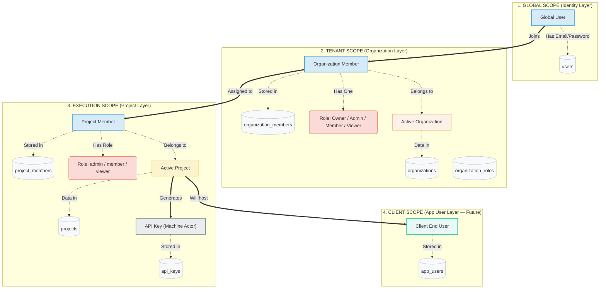
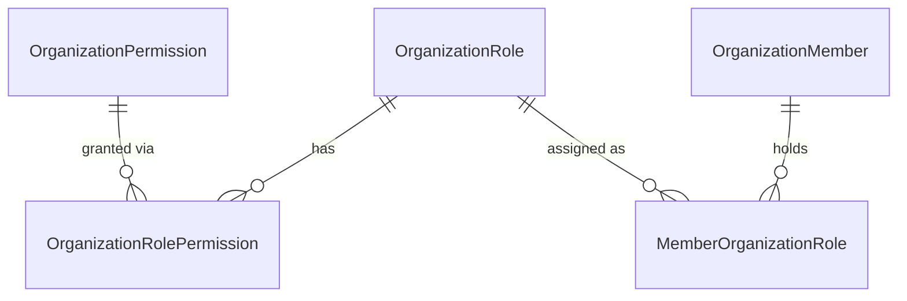

# VyoLayer System Design

VyoLayer is a **Backend-as-a-Service (BaaS) platform** for internal engineering teams. It provides out-of-the-box authentication, multi-tenant organizations, project-scoped isolation, role-based access control, API key management, and an audit trail — removing the need to rebuild this infrastructure for every internal tool.

---

## 1. Core Architecture

### Philosophy

The backend follows **Clean Architecture** — hard dependency boundaries flow inward:

```
HTTP Request
    │
    ▼
Controller          ← parses DTOs, delegates, returns responses
    │
    ▼
Service             ← business logic, domain rules, orchestration
    │
    ▼
Repository          ← data access, model↔domain mapping
    │
    ▼
GORM Model          ← PostgreSQL table schema
    │
    ▼
Domain Entity       ← pure business struct (no framework deps)
```

The **domain layer** at the bottom never imports from layers above it. This ensures business rules can be tested without a database or HTTP stack.

### Tech Stack

| Component        | Choice                                |
| ---------------- | ------------------------------------- |
| Language         | Go                                    |
| Web Framework    | Fiber v2                              |
| ORM              | GORM                                  |
| Database         | PostgreSQL                            |
| Frontend         | React 19, TanStack Start/Router/Query |
| Styling          | Tailwind CSS + shadcn/ui              |
| Monorepo tooling | pnpm workspaces                       |

---

## 2. Scope Model (4 Layers)

VyoLayer organizes data across four nested scopes. Each scope is a strict permission boundary.



---

## 3. Data Model

### 3.1 Identity

**`users`**

The global identity table. All authentication happens against this record.

| Column              | Type             | Notes                         |
| ------------------- | ---------------- | ----------------------------- |
| `id`                | uuid (PK)        | `gen_random_uuid()`           |
| `email`             | varchar (unique) | Login identifier              |
| `password_hash`     | varchar          | bcrypt                        |
| `full_name`         | varchar(100)     |                               |
| `is_email_verified` | bool             | Not yet enforced in all flows |
| `is_active`         | bool             | Soft-disable                  |
| `last_login_at`     | timestamp?       |                               |

**`user_sessions`**

Tracks refresh tokens (one active session per user). Enables device-specific invalidation.

| Column       | Type              | Notes                    |
| ------------ | ----------------- | ------------------------ |
| `id`         | uuid (PK)         |                          |
| `user_id`    | uuid (FK → users) |                          |
| `token_hash` | varchar (unique)  | SHA-256 of refresh token |
| `expires_at` | timestamp         |                          |
| `revoked`    | bool              |                          |
| `reason`     | varchar           | Why revoked              |
| `ip_address` | varchar           |                          |
| `user_agent` | varchar           |                          |

---

### 3.2 Organization (Tenant Layer)

**`organizations`**

The root multi-tenancy boundary. All members, projects, and permissions belong to an organization.

| Column      | Type              | Notes                   |
| ----------- | ----------------- | ----------------------- |
| `id`        | uuid (PK)         |                         |
| `name`      | varchar           |                         |
| `slug`      | varchar (unique)  | URL-friendly identifier |
| `owner_id`  | uuid (FK → users) | Ownership reference     |
| `is_active` | bool              | Archive flag            |

**`organization_members`**

Junction between a global User and an Organization. One user may be a member of many orgs.

| Column            | Type                | Notes                       |
| ----------------- | ------------------- | --------------------------- |
| `id`              | uuid (PK)           |                             |
| `organization_id` | uuid (FK)           | Cascade delete              |
| `user_id`         | uuid (FK)           | Cascade delete              |
| `invited_at`      | timestamp?          |                             |
| `invited_by`      | uuid?               | org_member id               |
| `joined_at`       | timestamp?          | Null if pending             |
| `removed_at`      | timestamp?          | Soft-remove                 |
| `removed_by`      | uuid?               | org_member id               |
| _(unique)_        | `(org_id, user_id)` | One record per user per org |

**`organization_member_invitations`**

One-time tokenized email invitations.

| Column            | Type                | Notes                                      |
| ----------------- | ------------------- | ------------------------------------------ |
| `id`              | uuid (PK)           |                                            |
| `organization_id` | uuid                |                                            |
| `invited_by`      | uuid                | org_member id                              |
| `email`           | varchar(255)        | Unique per org                             |
| `token`           | varchar(64, unique) | Sent in email link                         |
| `role_ids`        | text                | JSON array of role IDs to assign on accept |
| `invited_at`      | timestamp           |                                            |
| `is_accepted`     | bool                |                                            |
| `accepted_at`     | timestamp?          |                                            |
| `expired_at`      | timestamp           |                                            |
| `deleted_by`      | uuid?               | Soft-cancel by admin                       |

---

### 3.3 RBAC (Organization-Level)

Organization RBAC uses a **Roles → Permissions** model seeded at startup.



**`organization_roles`** — system-seeded + future custom roles

| Role     | Default | Description                            |
| -------- | ------- | -------------------------------------- |
| `Owner`  | No      | Full control; assigned on org creation |
| `Admin`  | No      | Manage members, projects, settings     |
| `Member` | **Yes** | Standard access; auto-assigned on join |
| `Viewer` | No      | Read-only access                       |

**`organization_permissions`** — fine-grained resource+action pairs

| Resource       | Actions                              |
| -------------- | ------------------------------------ |
| `organization` | read, update, delete                 |
| `member`       | invite, remove, list, view           |
| `role`         | create, update, delete, view, manage |
| `project`      | create, read, update, delete         |
| `audit`        | read                                 |

**`organization_role_permissions`** — many-to-many join (RoleID ↔ PermissionID)

**`member_organization_roles`** — assigns a role to a member, with `granted_by` / `revoked_by` tracking

---

### 3.4 Projects (Execution Layer)

**`projects`**

Sub-tenant boundary under an organization. Enforces hard limits on API keys and members.

| Column            | Type              | Notes                                |
| ----------------- | ----------------- | ------------------------------------ |
| `id`              | uuid (PK)         |                                      |
| `organization_id` | uuid (FK)         | Cascade delete                       |
| `name`            | varchar(100)      | Unique per org (composite with slug) |
| `slug`            | varchar(100)      | Auto-derived from name               |
| `description`     | text              |                                      |
| `is_active`       | bool              | Archive flag                         |
| `created_by`      | uuid (FK → users) | Restrict delete                      |
| `max_api_keys`    | int               | 1–10 (default 5)                     |
| `max_members`     | int               | 1–10 (default 5)                     |

**`project_members`**

| Column       | Type       | Notes                          |
| ------------ | ---------- | ------------------------------ |
| `id`         | uuid (PK)  |                                |
| `project_id` | uuid (FK)  | Cascade delete                 |
| `user_id`    | uuid       |                                |
| `role`       | varchar    | `admin`, `member`, or `viewer` |
| `is_active`  | bool       |                                |
| `added_by`   | uuid       | project_member id              |
| `joined_at`  | timestamp  |                                |
| `removed_at` | timestamp? |                                |
| `removed_by` | uuid?      | project_member id              |

Project-level roles are **not** seeded nor permission-mapped — they use a simple string hierarchy enforced in domain logic:

```
viewer  ⊂  member  ⊂  admin
```

`IsViewer()` returns true for all three; `IsMember()` for member + admin; `IsAdmin()` only for admin.

**`project_invitations`** _(schema exists, routes not yet wired)_

Same token-based flow as org invitations, scoped to a project.

---

### 3.5 API Keys

**`api_keys`**

Programmatic machine actors scoped to a project. Only the SHA-256 hash of the raw key is stored. The raw key is returned **once at generation** and cannot be retrieved again.

| Column            | Type                 | Notes                                    |
| ----------------- | -------------------- | ---------------------------------------- |
| `id`              | uuid (PK)            |                                          |
| `organization_id` | uuid (FK)            | Cascade delete                           |
| `project_id`      | uuid (FK)            | Cascade delete                           |
| `name`            | varchar(100)         | User-friendly label                      |
| `key_prefix`      | varchar(16)          | Visible identifier (e.g. `wl_live_ab3f`) |
| `key_hash`        | varchar(255, unique) | SHA-256 of raw key                       |
| `mode`            | varchar(10)          | `dev` or `live`                          |
| `created_by`      | uuid (FK → users)    |                                          |
| `expires_at`      | timestamp?           | Optional expiry                          |
| `last_used_at`    | timestamp?           | Updated on use                           |
| `revoked_at`      | timestamp?           | Revocation marker                        |
| `revoked_by`      | uuid?                | User ID who revoked                      |
| `request_limit`   | int                  | Max requests/day (0 = unlimited)         |
| `rate_limit`      | int                  | Max requests/minute                      |

**Mode defaults:**

| Mode   | request_limit | rate_limit |
| ------ | ------------- | ---------- |
| `dev`  | 1,000 / day   | 60 / min   |
| `live` | unlimited (0) | 600 / min  |

**`api_key_usage_logs`** _(schema exists, usage middleware not yet wired)_

Append-only log per API request: endpoint, method, status code, IP, user agent.

---

### 3.6 Audit Log

`audit_logs` is an append-only table capturing state mutations at service boundaries.

| Column                    | Type            | Notes                                |
| ------------------------- | --------------- | ------------------------------------ |
| `id`                      | uuid (PK, auto) | `gen_random_uuid()`                  |
| `organization_id`         | uuid            | Scoped to org                        |
| `actor_id`                | uuid            | Who performed the action             |
| `actor_type`              | varchar(50)     | `user`, `member`                     |
| `action`                  | varchar(100)    | e.g. `org.created`, `member.invited` |
| `resource_type`           | varchar(50)     | e.g. `organization`, `project`       |
| `resource_id`             | uuid            | Subject of the action                |
| `secondary_resource_type` | varchar(50)     | Optional second resource             |
| `secondary_resource_id`   | uuid            |                                      |
| `metadata`                | jsonb           | Arbitrary context                    |
| `ip_address`              | varchar         |                                      |
| `user_agent`              | varchar         |                                      |
| `request_id`              | uuid            | Correlates to the HTTP request       |
| `severity`                | varchar(20)     | `info`, `warning`, `critical`        |
| `created_at`              | timestamp       | Immutable                            |

---

## 4. Typed ID System

All public-facing IDs carry a **type-safe prefix** to prevent accidental cross-type ID usage (e.g. passing a `user_*` ID where a `project_*` is expected).

```
user_<uuid>
org_<uuid>
org_member_<uuid>
org_role_<uuid>
org_permission_<uuid>
org_invitation_<uuid>
project_<uuid>
project_member_<uuid>
project_role_<uuid>
project_permission_<uuid>
project_invitation_<uuid>
api_key_<uuid>
```

Implemented via a generic `PublicID[T IDPrefix]` struct in `internal/platform/database/types/ids.go`. Each concrete ID type (e.g. `OrganizationID`, `ProjectID`) is a distinct interface — the Go type system prevents mixing them at compile time.

Source: `ids.go` provides `NewXxx()`, `ReconstructXxx(string)`, and `ParseXxx(string)` constructors for every ID type.

---

## 5. Authentication & Authorization Flow

### 5.1 Session Architecture

VyoLayer uses **short-lived JWTs** (access tokens) + **long-lived refresh tokens** stored in `UserSession`.

```
Login/Register
    │
    ├─► Issue access_token  (JWT, HttpOnly cookie)
    └─► Issue refresh_token (opaque, stored as SHA-256 hash in user_sessions)

Subsequent requests
    │
    ├─► Read access_token from cookie OR Authorization: Bearer header
    ├─► Validate JWT (expiry, signature)
    ├─► If 401 → client calls POST /auth/refresh
    │       └─► Rotate: invalidate old session hash, issue new pair
    └─► Inject user_id + user_email into fiber ctx.Locals
```

### 5.2 Middleware Pipeline

Every inbound request passes through this ordered chain:

```
1. RequestContext       → Initializes request-scoped trace/correlation IDs
2. ErrorHandler         → Converts panics and Go errors → standardised JSON error body
3. CORS
4. Fiber Logger
5. Panic Recovery
6. Metrics (/metrics)
7. Swagger (/swagger/*)
8. v1 Routes (/api/v1/*)
   │
   ├── AuthMiddleware.JwtValidated()
   │       Extracts JWT from cookie or Bearer header
   │       Writes user_id, user_email → ctx.Locals
   │
   ├── OrgMiddleware.CheckOrganizationMembership()  [org-scoped routes]
   │       Resolves :orgId param
   │       Verifies caller is an active org member
   │       Writes org_member → ctx.Locals
   │
   └── ProjectMiddleware.CheckProjectMembership()   [project-scoped routes, future]
           Resolves :projectId param
           Verifies caller is an active project member
           Writes project_member → ctx.Locals
9. NotFound handler
```

### 5.3 Authorization Enforcement

| Level          | Enforced by                                         |
| -------------- | --------------------------------------------------- |
| Authenticated  | `AuthMiddleware.JwtValidated()`                     |
| Org member     | `OrgMiddleware.CheckOrganizationMembership()`       |
| Org admin      | Permission check inside service layer (RBAC lookup) |
| Org owner      | `org.OwnerID == caller.UserID` check in service     |
| Project member | `ProjectMiddleware.CheckProjectMembership()`        |
| Project admin  | `projectMember.IsAdmin()` check in service          |

---

## 6. Backend Layers in Detail

### 6.1 Controller Layer (`internal/app/controller`)

Responsibilities:

- Parse and validate incoming request bodies (as DTOs from `internal/app/dto`)
- Extract typed path/query parameters
- Call the appropriate service method
- Return success or error via the `response.Success` / `response.Error` helpers

Controllers never contain business logic. They are thin HTTP adapters.

### 6.2 Service Layer (`internal/service`)

Responsibilities:

- Own all business logic and cross-entity invariants
- Work exclusively with **domain entities** (not GORM models)
- Call one or more repositories within a single operation
- Emit audit log entries for significant mutations
- Return `*errors.AppError` (typed, code-carrying errors) on failure

Key services:

| Service                               | Key responsibilities                               |
| ------------------------------------- | -------------------------------------------------- |
| `AuthService`                         | Password verification, JWT claims                  |
| `SessionService`                      | Refresh token rotation, session invalidation       |
| `UserService`                         | Profile retrieval                                  |
| `OrganizationService`                 | Org CRUD, archive/restore, delete, onboarding      |
| `OrganizationMemberService`           | Membership management, ownership transfer          |
| `OrganizationMemberInvitationService` | Email invitation lifecycle                         |
| `OrganizationRBACService`             | Role + permission queries                          |
| `ProjectService`                      | Project CRUD, archive/restore/delete               |
| `ProjectMemberService`                | Project membership, role changes, leave            |
| `ApiKeyService`                       | Key generation (raw key returned once), revocation |
| `TokenService`                        | JWT signing/parsing                                |

### 6.3 Repository Layer (`internal/repository`)

Responsibilities:

- Translate GORM models → domain entities (via `internal/platform/database/mapper`)
- Provide typed query methods for each entity
- Never expose raw GORM to the service layer

All repositories are registered in `repository.Registry` and injected into services via `dependencies.go`.

### 6.4 Domain Layer (`internal/domain`)

Pure Go structs with embedded business methods. No imports from `internal/app`, `internal/repository`, or GORM. Key design points:

- **Constructor functions** (`NewXxx`) enforce invariants and generate IDs at creation time
- **Reconstruct functions** (`ReconstructXxx`) rebuild entities from stored data without re-applying creation-time logic
- **Method-level guards** (e.g. `Project.Deactivate()` returns an error if already inactive)
- **Role hierarchy** encoded directly in methods (e.g. `ProjectMember.IsViewer()` returns true for all three roles)

---

## 7. API Key Security Model

```
Generation (one-time):
  1. Service generates a cryptographically random raw key
  2. Derives a short key_prefix (e.g. "wl_live_ab3f") for identification
  3. Computes SHA-256(raw_key) → stores as key_hash
  4. Returns raw_key once in response body — never stored, never retrievable again

Verification (per request, future):
  1. Caller sends raw_key in Authorization: ApiKey <key> header
  2. Middleware computes SHA-256(raw_key)
  3. Looks up api_keys WHERE key_hash = $hash
  4. Checks IsRevoked() and IsExpired()
  5. Checks rate/request limits
  6. Logs to api_key_usage_logs
```

---

## 8. Frontend Architecture

### 8.1 Overview

The console app (`apps/console-app`) is a single-page application co-located in the monorepo.

| Layer        | Implementation                                 |
| ------------ | ---------------------------------------------- |
| Routing      | TanStack Router (file-based, type-safe params) |
| Server-state | TanStack Query (stale-while-revalidate)        |
| Auth state   | React Context (`AuthContext`)                  |
| Org state    | React Context (`OrganizationContext`)          |
| HTTP         | Custom `api.ts` fetch wrapper                  |
| UI           | Tailwind CSS + shadcn/ui components            |

### 8.2 API Client (`lib/api.ts`)

```
fetchWithAuth(url, options)
    │
    ├─► fetch(url, { credentials: 'include', ... })
    │
    ├─► If response.status === 401:
    │       POST /auth/refresh   (rotates cookies server-side)
    │       retry original request once
    │
    └─► handleResponse<T>()
            204 → return undefined
            success=false → throw ApiError (typed: code, statusCode, details)
            success=true  → return data
```

### 8.3 Feature Module Structure

Features are self-contained under `src/features/<name>/`:

```
features/<name>/
├── types/        → TypeScript interfaces (mirror backend domain)
├── services/     → Raw API calls (thin wrappers around api.ts)
├── hooks/        → React Query hooks (useQuery / useMutation)
├── components/   → Feature-specific UI components
└── pages/        → Full-page views rendered by routes
```

Current feature modules:

| Module          | Coverage                                              |
| --------------- | ----------------------------------------------------- |
| `auth`          | Login, register, invite accept                        |
| `landing`       | Landing page components                               |
| `organizations` | Org CRUD, members, invitations, RBAC, settings, audit |
| `projects`      | Project CRUD, members, API keys, settings             |

### 8.4 Route Hierarchy

```
/                           _landing layout
/auth/*                     auth flow (login, register)
/invite/$token              invitation accept

/_authenticated layout      (auth guard)
  /dashboard
  /onboarding
  /account
  /settings

  /org/$slug layout          (org context resolved)
    /                        org overview
    /members
    /members/$id
    /me
    /settings
    /archive
    /audit/*
    /danger

    /projects                projects list
    /projects/$projectId layout    (project sub-nav)
      /                      project overview
      /members               project member management
      /api-keys              API key management
      /settings              project settings + danger zone
```

---

## 9. Database Migration Strategy

Migrations run via `cmd/migrate/main.go` which calls `database.Migrate()` with all registered GORM model pointers. GORM `AutoMigrate` handles schema diffs (additive only — columns, indexes, constraints).

The `uuid-ossp` extension is enabled automatically before migration runs. All primary keys are UUID, generated client-side via the `BeforeCreate` GORM hook on `BaseModel`.

---

## 10. Known Gaps & Planned Work

| Gap                                                | Status                                                 |
| -------------------------------------------------- | ------------------------------------------------------ |
| Password change endpoint                           | Backend not implemented; frontend form exists          |
| Project invitation routes                          | Schema and domain exist; controller + routes not wired |
| API key usage logging middleware                   | Schema exists; per-request logging not wired           |
| `ProjectMiddleware.IsProjectAdmin()` has dead code | Minor cleanup needed                                   |
| Backend test coverage                              | Minimal (1 domain test file)                           |
| Frontend test coverage                             | Zero test files                                        |
| Local Go toolchain (snap)                          | `go test ./...` blocked; snap permission issue         |

_Last updated: March 7, 2026_
